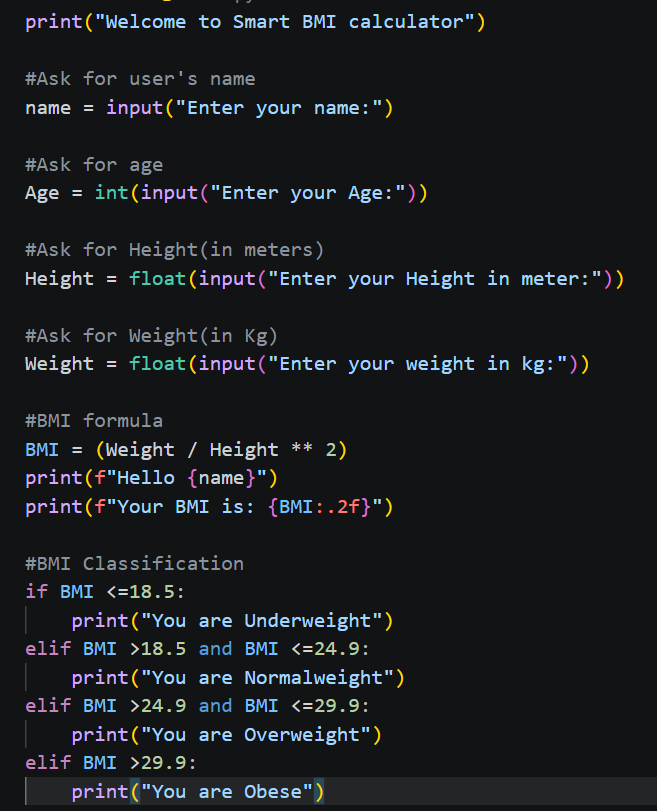
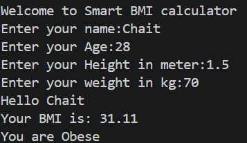

# Educational Smart BMI Calculator

A small Python application that demonstrates validated numeric input, a BMI
calculation, and category boundaries. It is informational only and is not
medical advice.

## Features

- Rejects non-numeric, non-finite, zero, and negative height/weight values
- Keeps calculation and classification logic import-safe and testable
- Uses explicit category boundaries, including 18.5 as `Healthy weight`

## Run

```bash
python main.py
```

## Test

From the repository root:

```bash
python -m pytest smart-BMI-Calculator
```

## Screenshots




